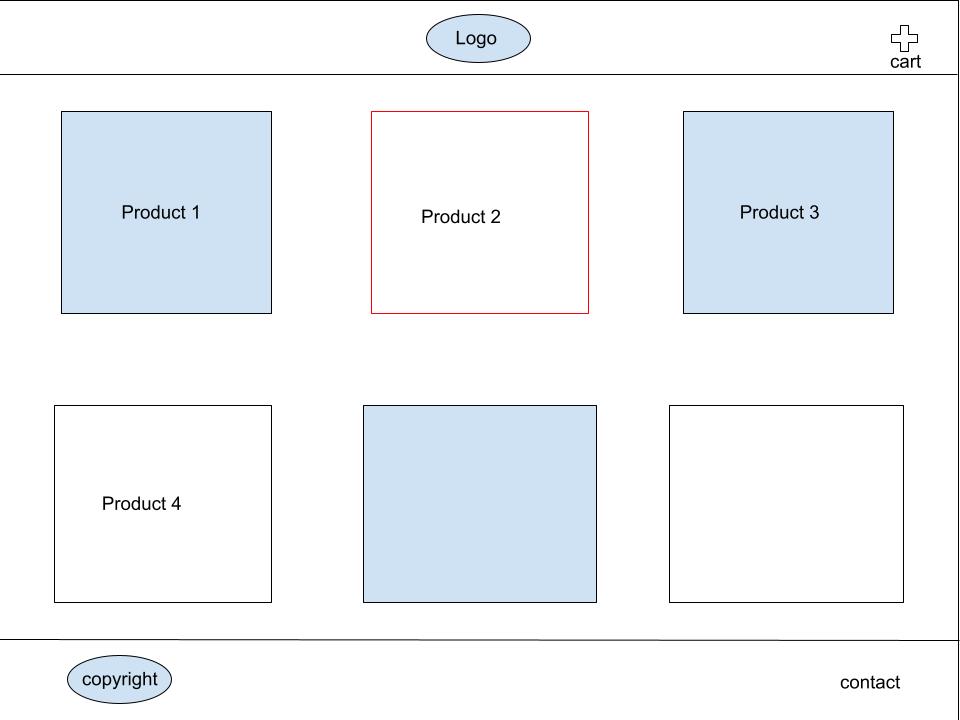
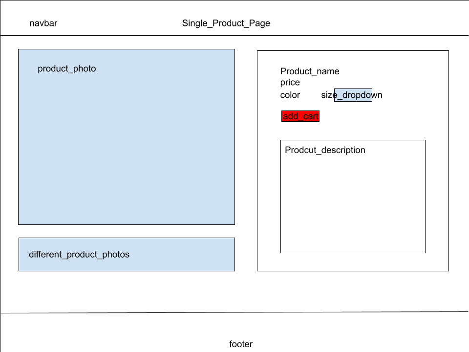

# Frogge Inc. 

## Welcome to the Frogge merch website!
Website deployed on [HEROKU!](https://frogge-e-commerce.herokuapp.com/)

This website was built using React, Node.js, and Express. The application will allows users to scroll through a list of merchandise and add items to their cart. They can then open up their cart to see the subtotal of the products added, and then proceed to checkout, powered by Stripe, to finalize their order. There are a total of 5 pages: Home, Cart, Contact, Checkout, and a landing page. 

### User Story

```
AS a user, 
I WANT to be able to easily browse and search for products on an e-commerce website, 
SO THAT I can find the items that I am interested in purchasing. 
```

### Acceptance Criteria

```
GIVEN a user is on the home page, 
WHEN the user clicks on a product, 
THEN the user is taken to the product page.
GIVEN a user is on the product page, 
WHEN the user clicks on the add to cart button, 
THEN the product is added to the cart.
GIVEN a user is on the cart page, 
WHEN the user clicks on the checkout button, 
THEN the user is taken to the checkout page.
```

### Home Page Sketch (More found in the images folder)


### Single Product Page Sketch (More found in the images folder)


### Technologies used
- React for building the user interface and handling client-side logic.
- Node.js for running JavaScript on the server-side.
- Express for routing and handling server-side logic.
- Stripe for handling payments.
- MongoDB for storing data.
- Mongoose for modeling data.
- Heroku for deployment.

### Features
- Browse and purchase merchandise.
- Add items to cart and view cart.
- Send a complaint form to the admin.
- Checkout with Stripe.

### Deployment

This website is deployed to Heroku through the following link [here!](https://frogge-merch.herokuapp.com/)

### Team Members

- Cory: In charge of front-end development and styling.
- Alex: In charge of front-end development and styling.
- Nick: In charge of back-end development and database management.

### Support

If you have any issues or questions, please don't hesitate to contact us.
